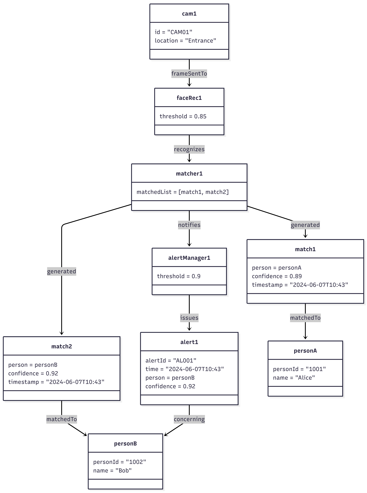
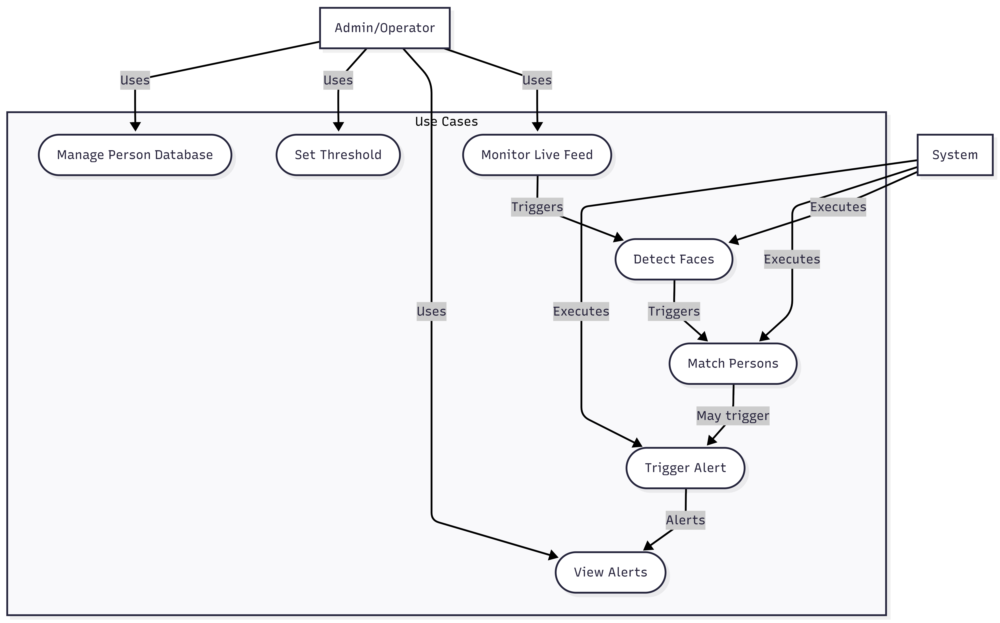

***LiveCam Face Recognition with Multi person matching and Threshold alert***
1.We want a upload button , where we can upload a photo through files.
2.When we upload a certain photo , we should compare the uploaded photo with face cam video.
3.The uploaded photo is then compared with the faces that are detected in the cam.
4.Show the similarity match percentage , between the uploaded image and multi faces in the cam.
5.If the match percentage is below 20 , then the words "Not the person " should appear under the box.
  If the match percentage is between 50-70 , then "Possibility chances".
  If the match percentage is 80-90, then "certainly could be the person".
  If the match is above 90 , then "FOUND THE PERSON".
6.Give an alert when the match above 90 is found.
7.Show the captured face of 90% match with "ALERT!!" as the output

***
1. ALERT BEEP SOUND AFTER THE PICTURE SIMILARITY IS ABOVE 85 .
2. MULTIPLE FACE DETECTION IS NOT WORKING , ONLY ONE PERSON FACE IS BEING DETECTED BUT NOT MULTIPLE FACES.
3. AFTER THE FACE IS FOUND , ALERT SOUND BEEP SHOULD RING AND THE CAPTURED FACE SHOULD BE SENT TO WHATSAPP OR MAIL AS A NOTIFICATION.
4. THE PERSON'S CAPTURED FACE FROM LIVE CAM WILL GO TO CERTAIN NUMBER OR MAIL .
5. THE IP ADDRESS OF THE DEVICE THAT SENT THE CAPTURED PHOTO SHOULD BE APPEARING AS WELL , IT SHOULD BE SENT IN MAIL OR WHATSAPP

ABSTRACT

Facial recognition technology has become an essential component in modern security and surveillance systems due to its non-intrusive nature and potential for accurate identification. This study presents a real-time face recognition system capable of detecting and identifying multiple faces simultaneously from a live camera feed. The system uses advanced face detection and encoding techniques to extract facial features and perform multi-face matching against a database of registered reference images. To improve reliability and reduce errors, a confidence-based similarity threshold is implemented, allowing the system to differentiate between high-probability matches, possible matches, and non-matches. When a detected face crosses predefined threshold levels, the system generates real-time alerts, including visual markers on the camera feed, audible notifications, and optional email alerts for critical situations.

The system architecture is designed for high-speed processing, employing frame optimization and efficient face encoding strategies to handle multiple faces without significant latency. Testing demonstrates that the system maintains robust performance under varying lighting conditions, partial occlusions, and dynamic environments, making it suitable for applications such as access control, crowd monitoring, and security surveillance. The framework emphasizes the integration of accuracy, scalability, and usability, offering a practical solution for monitoring multiple individuals in real-time while minimizing false positives and false negatives.
Experimental evaluation shows that the approach can effectively recognize faces in complex scenarios and provide timely alerts, enhancing situational awareness and security management. The system provides a comprehensive solution that combines automated detection, real-time monitoring, and threshold-based alert mechanisms, making it an effective tool for safety-critical environments.

This study advances computer vision by proposing an optimized, scalable framework for multi-person facial recognition, outperforming single-instance systems in crowded settings. Findings underscore deep learning's superiority in feature invariance compared to traditional methods like Histogram of Oriented Gradients (HOG) or Local Binary Patterns (LBP). Future enhancements include incorporating explainable AI (XAI) for decision transparency, integrating pose estimation with 3D models, and extending to multi-modal biometrics (e.g., gait analysis). Applications span security monitoring, access control, attendance systems, and human-robot interaction, ultimately bolstering automated identity management in diverse real-world contexts.

WORKING OF THE PROJECT

LiveCam Face Recognition with Multi-Person Matching and Threshold Alert

The system operates by integrating image upload, live camera streaming, face recognition, similarity analysis, and alert mechanisms into a single workflow.
Initially, the system provides an Upload Image option that allows the user to select a reference photograph from the local system. Once uploaded, the facial features of the image are extracted and encoded using a face recognition algorithm. This encoded data acts as the reference face template.
Simultaneously, the system activates the live webcam feed, where video frames are continuously captured in real time. Each frame is processed to detect multiple faces present in the camera view. For every detected face, facial landmarks and encodings are generated independently, enabling multi-person detection and comparison.

The extracted face encodings from the live camera are then compared with the uploaded reference face using a similarity calculation method. The system computes a match percentage for each detected face based on the distance between facial feature vectors.
For every face detected in the live feed, the match percentage and corresponding status message are displayed below the bounding box:

Below 20% → “Not the person”

50% – 70% → “Possibility chances”

80% – 90% → “Certainly could be the person”

Above 90% → “FOUND THE PERSON”

When a detected face exceeds the 85% similarity threshold, the system immediately triggers an alert beep sound to notify the user. If the match percentage crosses 90%, the system treats it as a confirmed match. At this stage, the matched face is captured from the live camera, highlighted with an “ALERT!!” label, and displayed as the output image.

Once a confirmed match is detected, the system performs the following alert actions automatically:
Captures and stores the matched face image
Retrieves the IP address of the device running the application

Sends the captured image along with the IP address and alert message to a predefined email address or WhatsApp number as a notification

The system continues to monitor the live feed until manually stopped, ensuring continuous multi-face detection, real-time comparison, and immediate alerts whenever a high-confidence match is found.

UML diagrams

Activity diagram :

Class diagram:

communication diagram:

component diagram:

object diagram:

sequence diagram:

state diagram:

use case diagram :

SOFTWARE TOOLS USED :

1️⃣ Python

Purpose: Core programming language used to develop the entire application

Why used: Simple syntax, strong library support for computer vision, GUI, threading, and automation

2️⃣ OpenCV (cv2)

Purpose: Live camera access and image processing

Usage in project:

Capturing live video from webcam

Drawing bounding boxes around detected faces

Resizing and processing frames

Library: opencv-python

3️⃣ face_recognition (dlib-based)

Purpose: Face detection and face matching

Usage in project:

Extracting facial encodings

Comparing reference image with live camera faces

Calculating face distance for similarity

Technology: Built on dlib + HOG/CNN models

4️⃣ Tkinter

Purpose: Graphical User Interface (GUI)

Usage in project:

Upload image button

Start/Stop camera controls

Fullscreen camera window

Email input popup

5️⃣ Pillow (PIL)

Purpose: Image conversion and rendering in GUI

Usage in project:

Convert OpenCV frames to Tkinter-compatible images

Display live video feed inside GUI

6️⃣ NumPy

Purpose: Numerical operations and array manipulation

Usage in project:

Frame resizing and padding

Image matrix handling

7️⃣ pyttsx3

Purpose: Text-to-Speech (TTS) engine

Usage in project:

Voice alert when a person is detected

8️⃣ Winsound 

Purpose: Audio alert (beep sound)

Usage in project:

Plays warning sound on detection

9️⃣ SMTP (smtplib)

Purpose: Email communication

Usage in project:

Sending alert emails with captured face image

Sending camera location and IP details

SSL

🔟 Socket

Purpose: Network information

Usage in project:

Fetching device IP address for alert email

1️⃣1️⃣ Threading

Purpose: Parallel execution

Usage in project:

Running camera feed without freezing GUI

Playing alerts and sending emails in background

1️⃣2️⃣ Operating System (OS) Module

Purpose: File and directory handling

Usage in project:

Creating folders (alerts, reference)

Saving captured images

CODE LIBRARIES USED :

Core Python Libraries:

1.os – File and directory management

2.time – Timestamp generation and delays

3.threading – Running camera, alerts, and email in parallel

4.socket – Fetching device IP address

5.smtplib – Sending alert emails via SMTP

6.email.message (EmailMessage) – Creating email content and attachments

External / Third-Party Libraries:

1.opencv-python (cv2)
Used for webcam access, frame capture, face bounding boxes, and image processing

2.face_recognition
Used for face detection, face encoding, and face matching using deep learning

3.Pillow (PIL.Image, PIL.ImageTk)
Used for converting OpenCV images to Tkinter-compatible formats

4.numpy (np)
Used for image array manipulation and resizing operations

5.pyttsx3
Used for offline text-to-speech voice alerts

GUI Libraries

1.tkinter
Used to build the graphical user interface

tkinter.filedialog – Image upload dialog

tkinter.messagebox – Error and alert popups

